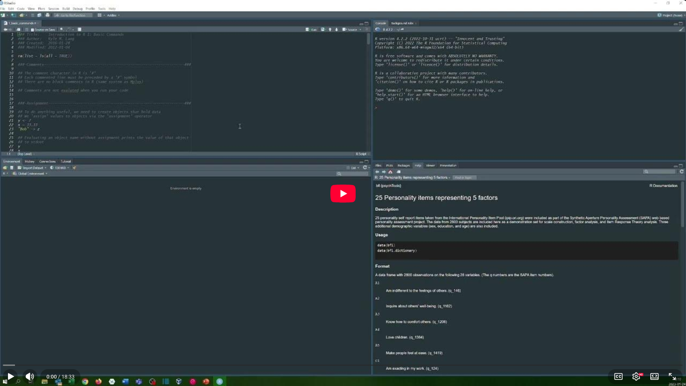

# Introduction to R

This repository will hold all of the materials for the Utrecht University Winter School course: *Introduction to R*.

## Preparation

The following video walks through the preparations you should make before joining the course meeting.

- NOTE: Clicking the video preview below will redirect you to YouTube.

To participate in this course, you will need a few things:

1. You will need access to the contents of this repository on your local machine.
   - If you're familiar with Git, you can clone this repository.
   - If you are not familiar with Git, you can download a ZIP archive of this repository's current content via the
   `Download ZIP` option in the drop-down menu triggered by the green `Code` button at the top of this page.
      - Extract the contents of this ZIP archive to a convenient location on your computer.
	  - We will be running the course out of this directory.
	  - Do not move any of the contents (doing so will break a bunch of relative file paths).
   - Note that I'll probably be pushing some last-minute updates, so you may want to pull down recent commits (or
   download a fresh ZIP image) on the morning of the course.
	 
2. You will also need to have `R` installed on your computer as well as some convenient way of working with `R` (e.g.,
   `RStudio`).
   - It will also be helpful to install the necessary add-on packages before the course begins.
   
### Installing R & RStudio

- You can obtain a free copy of `R` [here](https://cran.r-project.org). 
- You can download `RStudio` as stand-alone software [here](https://www.rstudio.com/products/rstudio/download/#download). 
  - You want the free, open-source *RStudio Desktop* version.

### Installing Necessary Packages

We will use several add-on packages in this course. You can save yourself some time and hassle at the beginning of the
course by installing these packages ahead of time.

#### Method 1

Open the script saved as [`code/00_install_packages.R`](code/00_install_packages.R) in `RStudio`, and run the contents.

- You can run the contents of the script by selecting all the text and hitting *CTRL-ENTER* on Windows/Linux or
*CMD-ENTER* on Mac.

#### Method 2

Copy-paste the following lines of code into the `RStudio` console window to execute the necessary command.

- If nothing happens after you paste the code, try hitting the "Enter/Return" key.

        install.packages(c("readr",
                           "haven",
                           "openxlsx",
                           "readxl",
                           "dplyr",
                           "magrittr",
                           "psych",
                           "ggplot2",
                           "gridExtra",
                           "tidyr"),
                         repos = "http://cloud.r-project.org",
                         dependencies = TRUE)

If you are asked the following question:

	Do you want to install from sources the package which needs 
    compilation? (Yes/no/cancel)

Type `Yes` in the console, and press the "Enter/Return" key (or click the 
corresponding button if the question presents as a dialog box). 

### Homework

We won't have much time together during the workshop meeting. To help us make the most of that time, you should work
through three preparatory tutorials before joining the course meeting. After you've completed the setup described above,
complete the following tutorials:

- [First Steps](https://openstatprog.com/first-steps/)
- [Data Types](https://openstatprog.com/data-types/)
- [External Data](https://openstatprog.com/external-data/)

If you understand most of what's covered in these tutorials, you're fully prepared for the in-person course meeting. If,
however, there are some (or many) points of confusion, don't worry. Just make a note of any confusing points you
encounter when working through these two scripts. We'll discuss any "homework" questions at the beginning of the
in-person course meeting.
